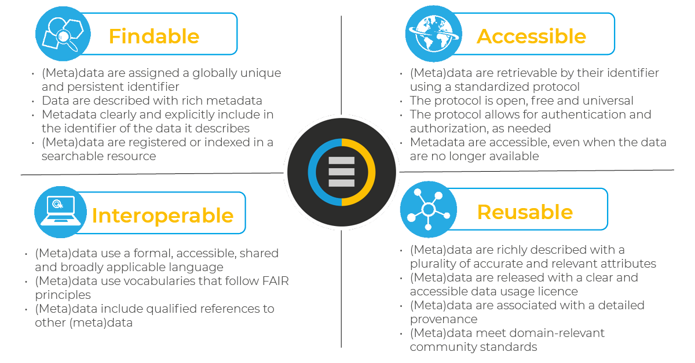
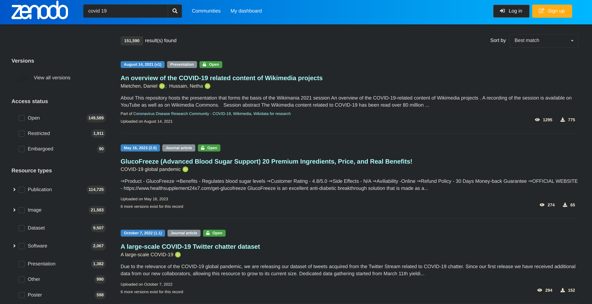
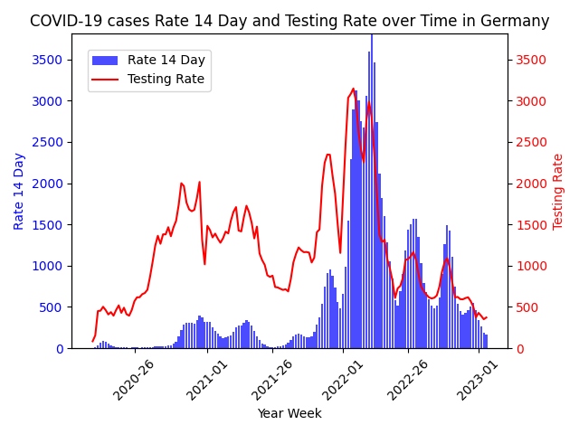
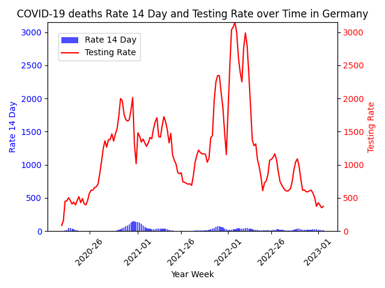

= MoSD Exam Data Management Plan
Johannes Franke <johannes.franke@uni-jena.de>
:description: The repository for the "Management of Scientific Data" exam containing informations about the creation process of the slides as well as the data and tools used.
:sectanchors: 
:toc:
:url-repo: https://github.com/JohannesF99/MoSD-Exam

== data lifecycle

=== Plan

. get an overview of all available material
. analyse the task of the exam
. create repository to store all metadata for the exam itself and to additionally add history to the project

. select one of the given scenarios
.. I chose the covid scenario because it is still very relevant to all of us and it pairs well with the topic of our ReproHack Review

. come up with a reasonable research question
.. i looked at the two datasets and took one of the more straightforward questions
.. "is there connection between cases/deaths and testing volume?"

. look detailed at the datasets on the website https://www.ecdc.europa.eu/en/publications-data/data-national-14-day-notification-rate-covid-19[cases/deaths dataset], https://www.ecdc.europa.eu/en/publications-data/covid-19-testing[testing volume dataset] (time frame from start 2020 till end 2023)
.. pro & cons cases/deaths dataset (ca. 12600 entries)
... available in many different formats
... pretty self explainatory csv file structure
... not that much metadata on the website itself
... link to github repo
.. pro & cons testing volume dataset (ca. 6100 entries)
... same as for the first dataset
... but much more metadata on the website
.. when downloading from the website, both files get saved as _data.csv_ so renaming is necessary

. select and fill out one DMP template
.. DMP can be found in `doc/ERC-Data-Management-Plan.pdf`
.. i chose the https://view.officeapps.live.com/op/view.aspx?src=https:%2F%2Fwww.tuwien.at%2Ffileadmin%2FAssets%2Fforschung%2FZentrum_Forschungsdatenmanagement%2Fdata-management-plan-template_HE_2021.docx&wdOrigin=BROWSELINK[Horizon Europe] template found https://www.zedif.uni-jena.de/en/180/data-management-plan[here]
.. reason: i thought that DMP are very hard to grasp when not working with an example, so i chose one DMP that resembled those in the exercise and that was not too large in size for the project

. add https://1drv.ms/p/c/f2ce6a35a4bcb8f8/Ef3r8rRFoS5Dqf2jEH2hNDEBzDQD1lS_tptfSfQJuwqiKA?e=rtUu87[slides] for the exam
.. development of slides in microsoft office (not ideal, but necessary because of the time constrain)
..  slides are also in the repository as _pptx_ and _pdf_

. go through the whole data lifecycle and add informations to all slides based on the lessons learned in the lecture and in the corresponding moodle tiles

=== Collect

. source for data
.. reported by EU/EEA Member States to the European Surveillance System (TESSy)
.. when not available, ECDC compiles data from public online sources
. auto collet of data
.. no need, data provided by ECDC (European Centre for Disease Prevention and Control) 
.. they automatically or manually retrieved (web-scraped) on a daily basis
. purpose of data collection
.. collect data to form a comprehensive answer to the research question
. amount of data
.. the two datasets have probably enough data for the analysis
. data representativeness
.. data is biased towards europe, no other countries included (could be interesting to compare)
.. quality or noise of the data can't be evaluated
. cost of collection process
.. collection cost by ECDC is not transparent
.. collection process for this scenario was done by me alone, so no additional costs
. cost of storage
.. data is placed in free github repository so no storage costs
. data collection strategy
.. no strategy required, maybe a little bit of preprocessing, e.g. select time frames, countries etc.
. the data is
.. quantitative data
.. structured data
.. generally trustworthy because of the ECDC

=== Assure

. Completeness
.. see _src/data_quality.ipynb_
.. only 7.63% of all rows in the deats/cases dataset have values of NA in important rows
.. but 18.86% of all rows in the testing dataset have NA values
. Uniqueness
.. is garantueed because of how the data is structured (one entry for every week for every country)
. Timeliness
.. is fairly representative
.. in a pandemic there is no guarantee that everything is 100% accurate
. Validity
.. all columns are valid and concise
.. if a value is not present, it's value is NA
. Accuracy
.. the data entries are for each week, so there is no (major) date format problem
.. in general: all columns have values that make sense and can be expected
. Consistency
.. good consistency
.. a minor flaw is that there are entries for countries but also for the EU as a whole. this could lead to some minor missunderstandings
.. also some country codes don't match between the two datasets, e.g. Austria (AUT/AT)
.. the column _year_week_ has different format, in one it has a leading "W" for the week-number

In general there are a few multi source problems on the instance level (inconsistent data) but apart from that, there are no major flaws. maybe a single source problem at the schema level with the EU/Country mixup

=== Describe

. most of the metadata is from the website itself
. for the testing dataset there is much more information available
. github repo doesn't offer any metadata
. in general more metadata everwhere would help
. BUT: the data itself is pretty self explainatory even as a non-medical person

=== Preserve

. the data website is from the ECDC, so that is pretty reliable with backups on github, so there is no single point of failure
. they could however upload the data to a research repository like zenodo
. there is no indicator that they published a paper with the datasets provided, but they could explicit tell if they "only" preserved or also published the data
. on the website itself there are no quality features 
. DOI or other PID are not found on the website or the repository
. authors are not named on the website at all, only the participants of the repository are visible
. metadata is present but to lesser extend for preservation/publishing etc.
. download options are fully supported in csv, xml, xlsx and json
. basic description and documentation is there, but it's by no means comprehensive
. the data is freely accessable for everyone
. there is no explicit licence in the repository but in the website is a link to the ECDC Copyright policy
.. ECDC has to be acknowledged as original author
.. The https://www.ecdc.europa.eu/en/copyright[copyright] policy of ECDC is compatible with CC BY 4.0 license
. there is no overview of the data at all, not even the column names
. archives are present for one time frame 20.06.2022 with additional starting script for R
. the repository has 42 commits but the initial commits are on the 01.12.2023, so at the end of the record time frame
. data is indexed by google and can be found pretty good @ 10

==== FAIR

Most of the FAIR criterias are met by the ECDC datasets.
The given informations are easy to find, even though there could be more. 
Also the Website is indexed on Google and other search engines, so machines/humans can find the data pretty easy. 
the structure of the data is very good and one can get started pretty fast (considering pre-exisiting knowledge in data science).
The data is free accessible without any kind of paywall or required login, but the files could have better naming conventions internally.
The data itself is pretty reusable but the repository lack some of the informations available on the website, including the licence.

To measure the FAIR principles, https://www.ccdc.cam.ac.uk/solutions/about-the-csd/fair-data-principles/[this] graphic was used, because it offers a compact overview over all criterias.

=== Discover

. covid datasets are pretty common, also because of the recency of the topic itself
. example i found: https://ourworldindata.org/covid-vaccinations[covid-19 vaccines]
.. uses also a 7-day-period, so can presumably work very well with the ECDC datasets
. also our ReporHack data can be used (topic: impact of fake news on vaccination) but probably harder to integrate without extensive preprocessing
. when searching for covid-19 on zenodo, one gets https://zenodo.org/search?q=covid%2019&l=list&p=1&s=10&sort=bestmatch[this] overview (or see picture below)
.. even though there are many articles found, when applying some filter criteria, zenodo only finds https://zenodo.org/search?q=covid%2019&f=access_status%3Aopen&f=resource_type%3Adataset&f=file_type%3Acsv&l=list&p=1&s=10&sort=bestmatch[1.297 results], many of wich are for very niche regions or countries
.. i would've liked the filter for a region to search datasets in, but this seems currently not supported
.. the dataset itself doesn't have any keywords or terms that may produce search results for similar data. 
.. zenodo probably offers more than only one sorting options, but the standard is _bestmatch_, so it probably uses some kind of BM25 retrieval system under the hood (but thats just speculation on my side)
..  searching for _covid-19_ or _covid 19_ doesn't change the number of results so they seem to remove special characters from the query terms
.. stopwords seem to get indexed by zenodo and remain in the query, so they make a difference 
.. there also is no stemming happening on the query terms (_buy_ vs. _buys_  results in different documents)

=== Integrate

. in this step, the datasets are processed in a way that makes it easier to analyse them and to find a solution for the research question
. because the goal is to see if there's a connection between cases/deaths and testing, the idea is to:
.. remove the leading "W" in the testing dataset _year_week_ column, so the format for both is the same
.. merge/join the datasets together based on the date
.. remove useless and redundand columns
.. remove NaN rows
.. export the dataset for every country in the directory `./data/per_country/` (so we have even an additional thing to analyse besides the main research question)
. this should be achieved with another jupyter notebook _data_processing.ipynb_
. when doing this part, i worked together with an artifical intelligence assistent to help me write the code, what shortened the developing part drastically

=== Analysis

. now comes the analysis itself, which will be demonstrated on one country dataset
.. but development should be in a way, that running the analysis for other countries should not take that much time.
. all developement happends now in the _data_analysis.ipynb_ notebook and with help of `matplotlib` (see chapter _Tools_ for all dependecies)
. it can be seen, that with rising test cases, also the covid-19 14 day rate rises, so there is a connection between those two factors
.. this shows that it is beneficial to test
.. this helps to fight the disease 

== data description

=== cases/death dataset

. country: 
.. type: string
. country_code: 
.. type: string
. continent: 
.. type: string
. population: 
.. type: integer
. indicator: 
.. type: string
.. description: either _cases_ or _deaths_
. weekly_count: 
.. type: integer?
. year_week: 
.. type: string
.. description: record date in format YYYY-WW, e.g. 2020-01
. rate_14_day: 
.. type: float?
.. description: new covid cases per 100k citizen in 14 days
. cumulative count:
.. type: integer?
. source:
.. type: string
. note:
.. type: ?? (probably string)

=== testing volume dataset

. country:
.. type: string
. country_code: 
.. type: string
. year_week: 
.. type: string
.. description: record date in format YYYY-_W_WW, e.g. 2020-W01
. level: 
.. type: string
.. description: always value "national"
. region:
.. type: string
.. description: same as _country_code_
. region_name:
.. type: string
.. description: same as _country_
. new_cases:
.. type: integer?
. tests_done:
.. type: integer?
. population:
.. type: integer
. testing_rate:
.. type: float?
. positivity_rate:
.. type: float?
. testing_data_source
.. type: string?

== Tools

. Ubuntu Oracular Oriole (development branch)
. Lenovo Yoga Slim 7 Pro 14ACH5 O
. AMD Ryzen™ 7 5800H with Radeon™ Graphics × 16 CPU
. 16,0 GiB RAM
. Linux 6.8.0-35-generic Kernel
. git
. VS Code 1.88.1
. Office 365 Web
. Python 3.12.3
. Python venv, pandas 2.2.2, ipykernel 6.29.5, matplotlib 3.9.1

== Repository

The repository is found here:

https://github.com/JohannesF99/MoSD-Exam